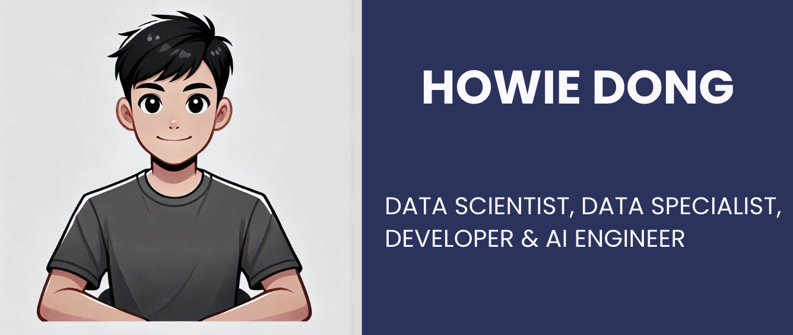

  <h2>
     
    &nbsp; Hi there 👋, my name is Howie (Sihan Dong) &nbsp; 
    
  </h2>

  

    Data Science 🔢, Artificial Intelligence 🧠, and IT 💻 in @Unimelb 🎓 &nbsp;
  

🚀 An enthusiastic and self-motivated IT professional pursuing a Master of Information Technology in Artificial Intelligence at the University of Melbourne. I’m eager to contribute to impactful data-driven projects, thrive in collaborative environments, and am passionate about continuous learning and problem-solving in the tech industry.

## Skills and Experience

💻 **Skills:** Python 🐍 / JAVA ☕ / Tableau 📊 / Matlab 📐 / R Studio 📈  

- 🔭 **Current Work:** Master of IT (AI and Data Science) 
- 🌱 **Currently Learning:** Modeling, Testing, Artificial Intelligence... 
- 📫 **Reach Me:** sidong@student.unimelb.edu.au or toidi0710@outlook.com

## Example of Works
- 

    

